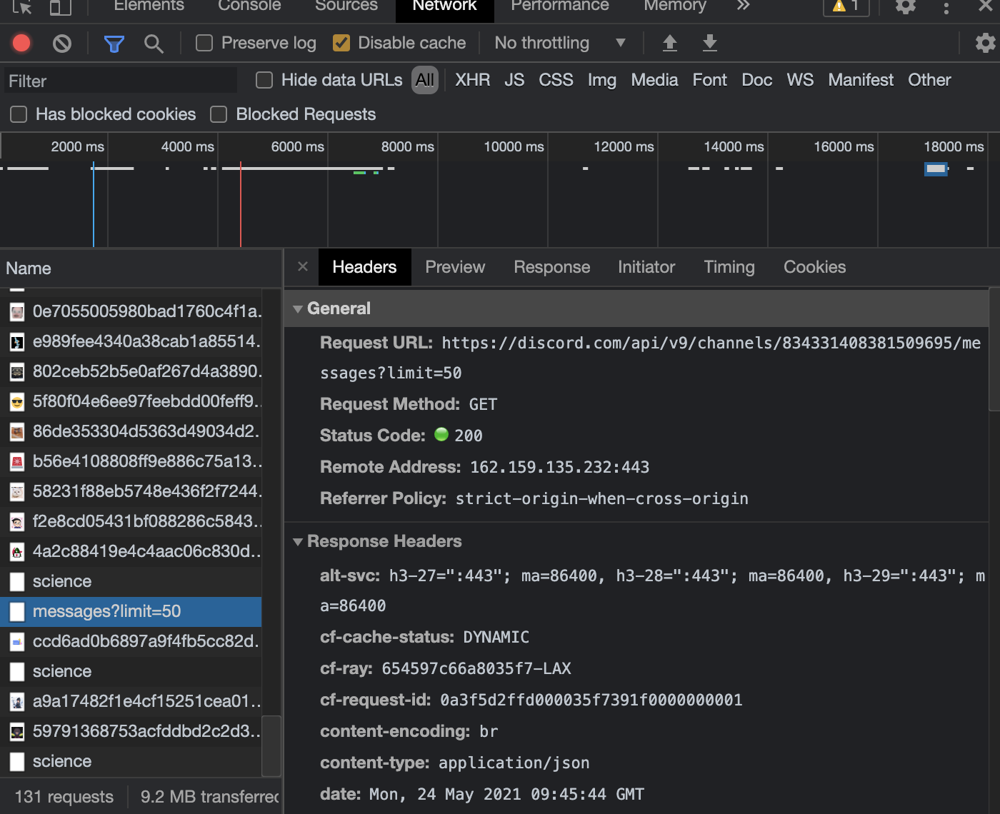
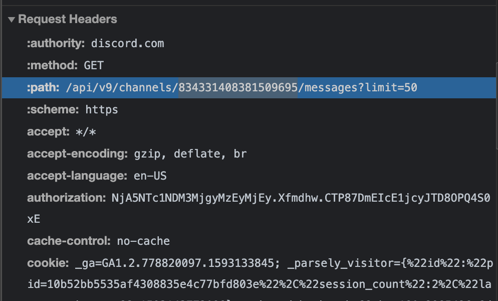
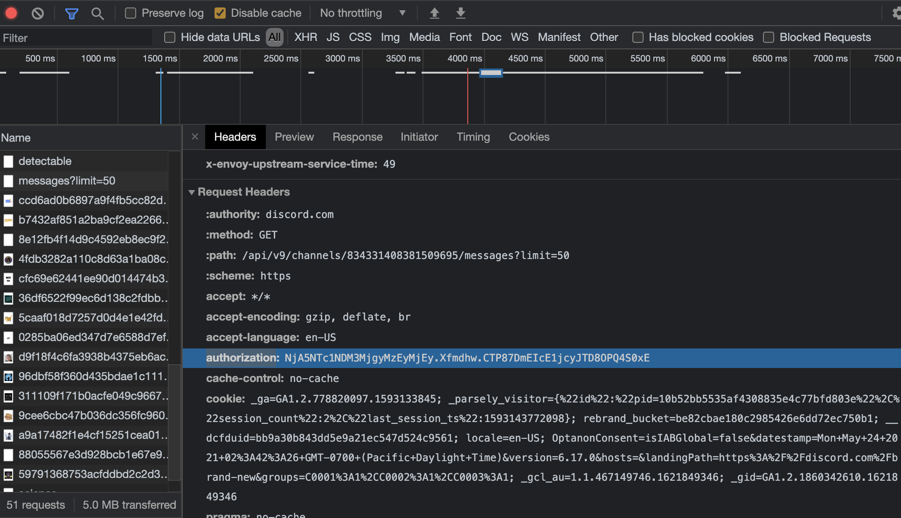

<div align="center">
  
</div>

<h1 align="center"> DiscordScraperCLI</h1>

<p align="center">A simple command line interface tool that scrapes messages from any discord channel.<p>

<hr>

## Table of Contents

- [Table of Contents](#table-of-contents)
- [Features](#features)
- [Getting Started](#getting-started)
  - [Prerequisites](#prerequisites)
  - [Installing Using pip](#installing-using-pip)
  - [Installing the Project Directly](#installing-the-project-directly)
- [ID's & Tokens](#ids--tokens)
  - [Getting a Channel's ID](#getting-a-channels-id)
  - [Getting Authorization Tokens](#getting-authorization-tokens)
- [Options](#options)
  - [Some Example Commands](#some-example-commands)
- [Acknowledgments](#acknowledgments)
- [Credits](#credits)
  - [Contact](#contact)

## Features

```bash
dsi get_json -a 38fl3hd9co -c 10083930 -d -f example.json
```

Prints the messages from the discord channel with ID `10083930` to console:

```JSON
{
  "this": "is",
  "some": "random",
  "blah": "JSON",
  "for": "now..."
}
```

And saves a full detalied list of messages to the file `example.json` in your machine's Download folder.

## Getting Started

### Prerequisites

First, ensure that your computer has Python with at least ***version 3.6*** installed. You can check your Python version number in your terminal using:

```properties
python --version
```

If you don't have Python or need to update to a newer version, [check out this link](https://www.python.org/downloads/)!

Next, ensure that `pip` is installed as well (newer version of Python should come with pip preinstalled). If you're unsure if your device has pip, [check out this link](https://pip.pypa.io/en/stable/installing/)!

### Installing Using pip

Coming soon... 8)

### Installing the Project Directly

After downloading the project, navigate to `/DiscordScraperCLI` directory in your terminal.

Next, run:

```properties
pip install .
```

This command will install all the neccessary packages for DiscordScraperCLI to work!

## ID's & Tokens

  Before you can use this tool, you are going need to do some digging first in order to figure out the channel id and your authorization token.

  Make sure you have a Discord account, are logged into the ***web app version*** of [Discord](https://discord.com), and that you either have ***Google Chrome*** (prefered and covered below),   ***FireFox***, or any other browser that has access to ***Developer Tools*** or some sort of tool that allows you to ***inspect network activity***.

### Getting a Channel's ID

  1. Navigate to Discord and be sure to stay on the web app version. Proceed to the server channel/private chat you want to scrape.

  2. Open up Google Developer tools
     - Option + ⌘ + J (on macOS)

     - Shift + CTRL + J (on Windows/Linux).

  3. Click on the `Network` tab.

  4. Scroll through the traffic and look for a request with `messages` in the name. If you do not initially see it, you may need to refresh the page.

     - 

  5. Scroll down to the `Request Headers` section. You will see a sub header called `:path:`. Discord formats their paths as `/api/{version number}/channels/{channel_id}/blah/blah/blah`. Copy the number that corresponds to `{channel_id}` and you are one step closer to being able to scrape some messages!



### Getting Authorization Tokens

  Follow the steps 1-4 as outlined in  outlined in [Getting a Channel's ID](#getting-a-channels-id). Now, scroll down to the `Request Headers` section. You will see a sub header called `:authorization:`. Copy the value and you are now ready to scrape some messages!



- Note: Unlike the channel ID, the authorization token does change, meaning you will need to open dev tools from time to time in order to get the new token.

## Options

```markdown
Usage: dsi [OPTIONS] COMMAND [ARGS]...

  dsi - DiscordScraperCLI (https://github.com/sirandluke/DiscordScraperCLI)

Options:
  --help  Show this message and exit.

Commands:
  get_csv   Save messages in a CSV file.
  get_json  Save messages in a JSON file.

Options:
    -a, --auth-token TEXT  Your discord account's authorization hashing [required]
    -c, --channel-id TEXT  Channel ID of the channel to scrape  [required]
    -d, --display          Display the messages from earliest to latest (defaults to false)
    -f, --file-name TEXT   Name of the file to save to (omit file type) (defaults to your Download folder)
    --help                 Show this message and exit.
```

### Some Example Commands

Be sure to first read [Getting a Channel's ID](#getting-a-channels-id) and [Getting Authorization Tokens](#getting-authorization-tokens) on how to get ID's and auth tokens.

- `dsi get_csv -a t0kEn10101 -c chvnN3l10101`
  - Saves messages from channel to a CSV file in Downloads folder.

- `dsi get_json -a t0kEn10101 -c chvnN3l10101`
  - Saves messages from channel to a JSON file in Downloads folder.

- `dsi get_json -a t0kEn10101 -c chvnN3l10101 -f ExampleMessages`
  - Saves the messages as JSON to a file called `ExampleMessages.json` in Downloads folder.

- `dsi get_csv -a t0kEn10101 -c chvnN3l10101 -d -f ExampleMessages`
  - Displays the messages to terminal and saves them a CSV file called `ExampleMessages.csv` in Downloads folder.

## Acknowledgments

- I would like to acknowledge [CodeDict](https://www.youtube.com/channel/UC8PPJFudLUM1eJlM4BiJ40A) and his video on how to use Chrome Developer tools in order to get messages from a specific channel.

- I would like to acknowledge [this post](https://stackoverflow.com/a/35851955) on how to get a user's Downloads folder for saving the JSON/CSV data.

## Credits

DiscordScraperCLI by [Luke Sirand](https://sirandluke.github.io/)

Logo by [@meeanin](https://www.instagram.com/meeanin/)

### Contact

  - If you run into any issues, please feel free to open an issue.

  - Alternatively you can contact me by email (lsirand@ucsd.edu)
